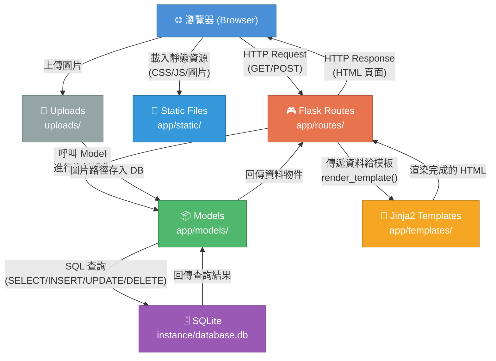
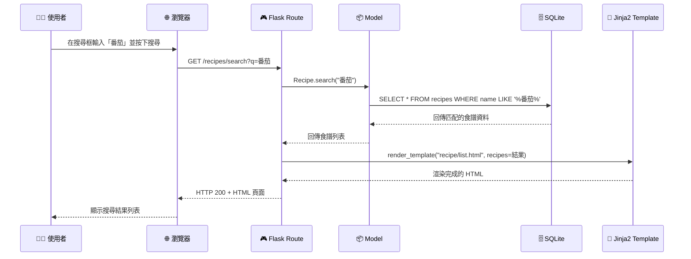

# 系統架構設計 — 食譜搜尋系統

## 1. 技術架構說明

### 選用技術與原因

| 技術 | 用途 | 選用原因 |
|------|------|----------|
| **Python** | 後端程式語言 | 語法簡潔易讀，適合初學者，生態豐富 |
| **Flask** | 後端 Web 框架 | 輕量級微框架，學習門檻低，彈性高，適合中小型專案 |
| **Jinja2** | HTML 模板引擎 | Flask 內建，可在 HTML 中嵌入 Python 邏輯，實現動態頁面渲染 |
| **SQLite** | 關聯式資料庫 | 不需額外安裝伺服器，單檔案即可運作，適合輕量級應用 |
| **HTML / CSS / JavaScript** | 前端頁面 | 標準 Web 技術，搭配 Jinja2 模板進行伺服器端渲染 |

### Flask MVC 模式說明

本專案採用 **MVC（Model-View-Controller）** 架構模式，將程式碼依職責分層，讓專案結構清晰易維護：

```
┌─────────────────────────────────────────────────────────┐
│                      瀏覽器 (Browser)                     │
│                  使用者透過瀏覽器操作系統                    │
└──────────────┬──────────────────────▲────────────────────┘
               │ HTTP Request        │ HTTP Response (HTML)
               ▼                     │
┌──────────────────────────────────────────────────────────┐
│              Controller（Flask Routes）                    │
│                   app/routes/                              │
│                                                           │
│  - 接收使用者的 HTTP 請求（GET / POST）                      │
│  - 呼叫 Model 進行資料操作                                  │
│  - 將資料傳遞給 View（Template）進行渲染                     │
│  - 回傳最終的 HTML 給瀏覽器                                 │
└───────┬───────────────────────────────────▲───────────────┘
        │ 讀取/寫入資料                      │ 渲染結果
        ▼                                   │
┌──────────────────┐          ┌──────────────────────────┐
│   Model（模型）    │          │    View（Jinja2 模板）     │
│  app/models/      │          │   app/templates/          │
│                   │          │                           │
│ - 定義資料表結構   │          │ - HTML 模板檔案           │
│ - 封裝 CRUD 操作  │          │ - 使用 Jinja2 語法顯示    │
│ - 與 SQLite 互動  │          │   動態資料                │
└───────┬───────────┘          └───────────────────────────┘
        │ SQL 查詢
        ▼
┌──────────────────┐
│  SQLite 資料庫    │
│ instance/        │
│   database.db    │
└──────────────────┘
```

**簡單來說：**
- **Model（模型）**：負責「資料」——定義資料表結構、讀寫資料庫
- **View（視圖）**：負責「畫面」——HTML 模板，決定使用者看到什麼
- **Controller（控制器）**：負責「邏輯」——接收請求、協調 Model 和 View

---

## 2. 專案資料夾結構

```
web_app_development/
│
├── app.py                    ← 應用程式入口，啟動 Flask 伺服器
├── config.py                 ← 設定檔（資料庫路徑、上傳設定等）
├── requirements.txt          ← Python 套件相依清單
│
├── app/                      ← 主要應用程式目錄
│   ├── __init__.py           ← Flask App 工廠函式，初始化應用程式
│   │
│   ├── models/               ← Model 層：資料庫模型
│   │   ├── __init__.py
│   │   ├── recipe.py         ← 食譜模型（CRUD 操作）
│   │   ├── ingredient.py     ← 食材模型
│   │   ├── category.py       ← 分類模型
│   │   └── favorite.py       ← 收藏模型
│   │
│   ├── routes/               ← Controller 層：Flask 路由
│   │   ├── __init__.py
│   │   ├── main.py           ← 首頁、通用頁面路由
│   │   ├── recipe.py         ← 食譜相關路由（搜尋、新增、編輯、刪除、詳情）
│   │   ├── category.py       ← 分類瀏覽路由
│   │   └── favorite.py       ← 收藏相關路由
│   │
│   ├── templates/            ← View 層：Jinja2 HTML 模板
│   │   ├── base.html         ← 基礎模板（共用 header / footer / navbar）
│   │   ├── index.html        ← 首頁（搜尋框 + 分類瀏覽 + 推薦食譜）
│   │   ├── recipe/
│   │   │   ├── list.html     ← 食譜列表頁（搜尋結果）
│   │   │   ├── detail.html   ← 食譜詳情頁（食材 + 步驟）
│   │   │   ├── create.html   ← 新增食譜表單
│   │   │   └── edit.html     ← 編輯食譜表單
│   │   ├── category/
│   │   │   └── list.html     ← 分類瀏覽頁
│   │   └── favorite/
│   │       └── list.html     ← 我的收藏頁
│   │
│   └── static/               ← 靜態資源
│       ├── css/
│       │   └── style.css     ← 主要樣式表
│       ├── js/
│       │   └── main.js       ← 前端互動邏輯（收藏按鈕、刪除確認等）
│       └── images/
│           └── default.png   ← 預設食譜圖片
│
├── uploads/                  ← 使用者上傳的食譜圖片存放區
│
├── instance/                 ← Flask 實例資料夾
│   └── database.db           ← SQLite 資料庫檔案
│
├── database/                 ← 資料庫相關腳本
│   └── schema.sql            ← SQL 建表語法
│
└── docs/                     ← 設計文件
    ├── PRD.md                ← 產品需求文件
    ├── ARCHITECTURE.md       ← 系統架構文件（本文件）
    ├── FLOWCHART.md          ← 流程圖
    ├── DB_DESIGN.md          ← 資料庫設計
    └── ROUTES.md             ← 路由設計
```

### 各資料夾用途說明

| 資料夾 / 檔案 | 用途說明 |
|---------------|----------|
| `app.py` | 整個應用的進入點，執行 `python app.py` 即可啟動伺服器 |
| `config.py` | 集中管理設定值（如資料庫路徑、上傳資料夾路徑、允許的檔案類型等） |
| `requirements.txt` | 記錄專案所需的 Python 套件，使用 `pip install -r requirements.txt` 安裝 |
| `app/__init__.py` | Flask App 工廠函式，負責建立 Flask 實例、註冊 Blueprint、初始化資料庫 |
| `app/models/` | 資料存取層，每個檔案對應一張資料表，封裝所有 SQL 操作 |
| `app/routes/` | 路由控制層，使用 Flask Blueprint 組織，每個檔案對應一組功能的路由 |
| `app/templates/` | HTML 模板，使用 Jinja2 語法嵌入動態資料，`base.html` 為共用版型 |
| `app/static/` | CSS、JavaScript、圖片等靜態資源，由瀏覽器直接載入 |
| `uploads/` | 使用者上傳的食譜圖片，與程式碼分離以便管理 |
| `instance/` | Flask 實例資料，存放 SQLite 資料庫檔案，不納入版本控制 |
| `database/` | 資料庫初始化腳本，方便重建資料庫 |
| `docs/` | 所有設計文件的集中存放處 |

---

## 3. 元件關係圖

以下使用 Mermaid 語法繪製系統元件之間的互動關係：



### 請求處理流程

以「搜尋食譜」為例，資料在各元件之間的流動：



---

## 4. 關鍵設計決策

### 決策一：使用 Flask Blueprint 組織路由

**選擇**：將不同功能的路由分散到多個檔案，使用 Flask Blueprint 機制註冊。

**原因**：
- 避免所有路由擠在同一個檔案，難以閱讀和維護
- 方便分工——每個組員可以負責不同的 Blueprint（例如一人負責 `recipe.py`，另一人負責 `favorite.py`）
- 符合模組化設計原則

### 決策二：圖片儲存於本機檔案系統

**選擇**：使用者上傳的食譜圖片存放在 `uploads/` 資料夾，資料庫僅儲存檔案路徑。

**原因**：
- SQLite 不適合儲存大量二進位資料（BLOB），會影響效能
- 檔案系統存取圖片效率更高
- 便於備份與管理
- 未來如需遷移至雲端儲存（如 AWS S3），只需修改儲存邏輯即可

### 決策三：使用 App 工廠模式（Application Factory）

**選擇**：在 `app/__init__.py` 中使用 `create_app()` 工廠函式建立 Flask 應用實例。

**原因**：
- 可依據不同環境（開發 / 測試 / 正式）載入不同設定
- 避免循環匯入問題
- 是 Flask 官方推薦的最佳實踐

### 決策四：使用原生 sqlite3 模組而非 ORM

**選擇**：使用 Python 內建的 `sqlite3` 模組直接操作資料庫，而非使用 SQLAlchemy 等 ORM。

**原因**：
- 減少額外的學習成本，適合初學者理解 SQL 操作原理
- 專案規模適中，不需要 ORM 的複雜功能
- 直接撰寫 SQL 語句，對資料庫操作有更清楚的掌握

### 決策五：使用 base.html 模板繼承機制

**選擇**：建立 `base.html` 作為共用的基礎模板，其他頁面透過 Jinja2 的 `` 繼承。

**原因**：
- 統一全站的頁首（Header）、導覽列（Navbar）、頁尾（Footer）
- 修改共用元素時只需改一個檔案，避免重複代碼
- 各頁面只需專注於自己的內容區塊（``）

---

## 5. 技術架構總結

```
┌─────────────────────────────────────────────────┐
│                   前端 (Frontend)                 │
│                                                   │
│  HTML (Jinja2 模板)  +  CSS (style.css)  +  JS    │
│  ➜ 伺服器端渲染，不需要前後端分離                    │
└──────────────────────┬──────────────────────────┘
                       │
┌──────────────────────▼──────────────────────────┐
│                   後端 (Backend)                   │
│                                                   │
│  Flask + Blueprint 路由 + Jinja2 模板引擎          │
│  ➜ 處理 HTTP 請求、商業邏輯、頁面渲染               │
└──────────────────────┬──────────────────────────┘
                       │
┌──────────────────────▼──────────────────────────┐
│                  資料層 (Data)                     │
│                                                   │
│  SQLite (sqlite3 模組) + 檔案系統 (uploads/)       │
│  ➜ 儲存食譜資料與圖片檔案                           │
└─────────────────────────────────────────────────┘
```

> **適合初學者的提示**：整個系統不需要前後端分離，所有頁面都由 Flask 在伺服器端渲染完成後送到瀏覽器。這表示你不需要學習 React、Vue 等前端框架，只要會寫 HTML + 一點 Jinja2 語法即可。
