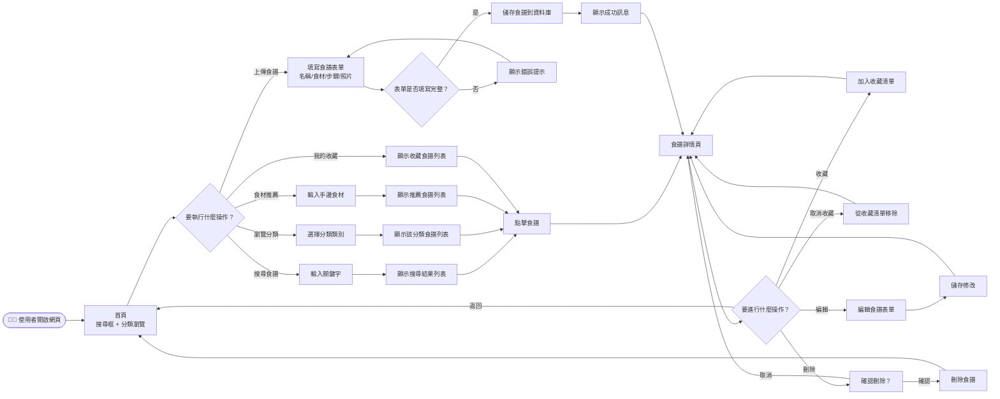
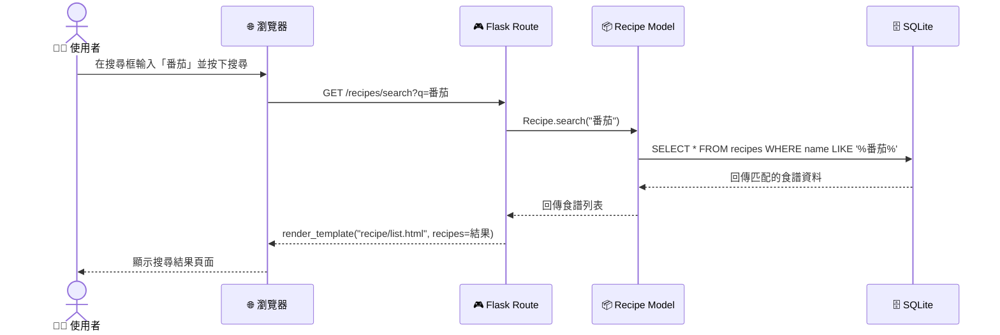
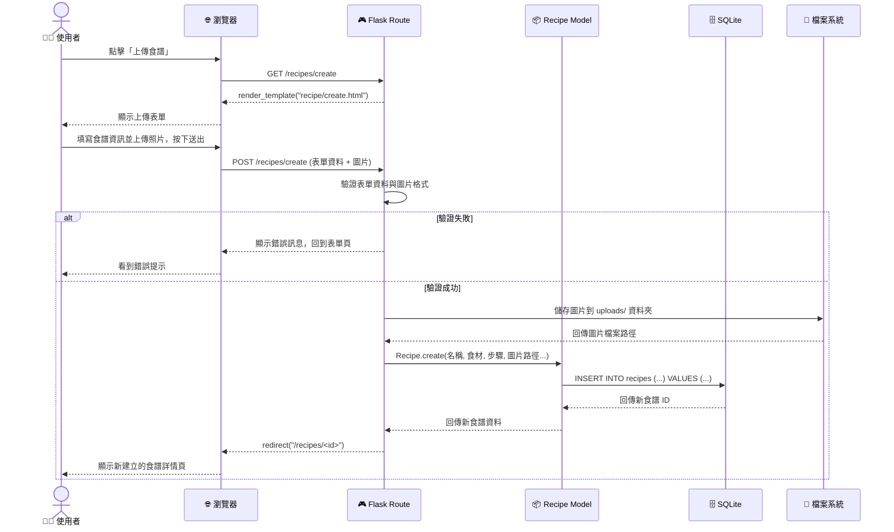
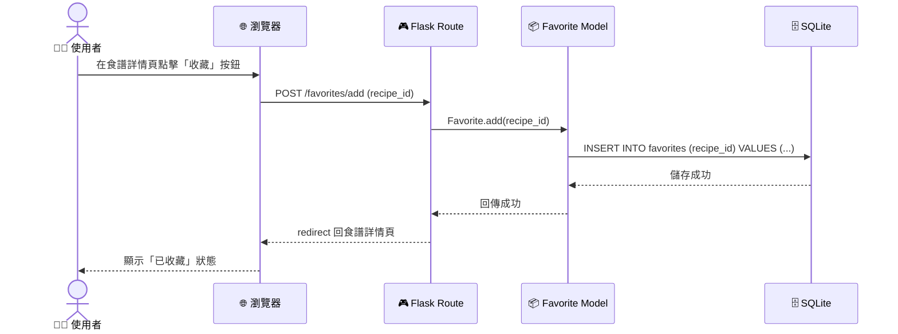
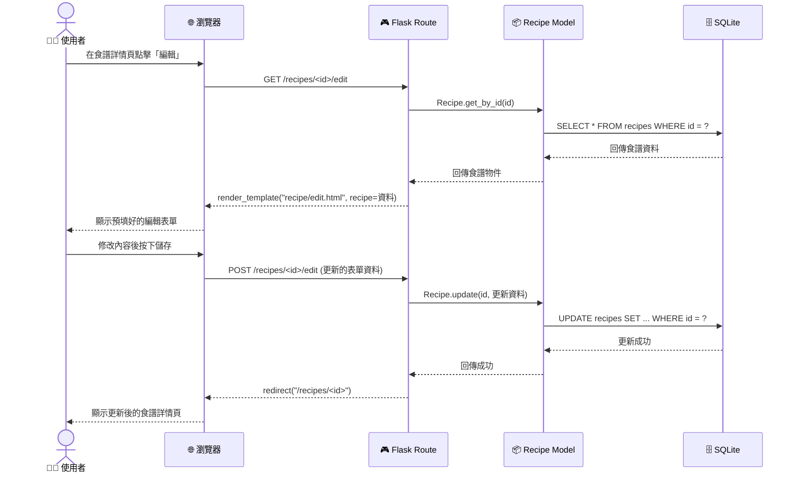
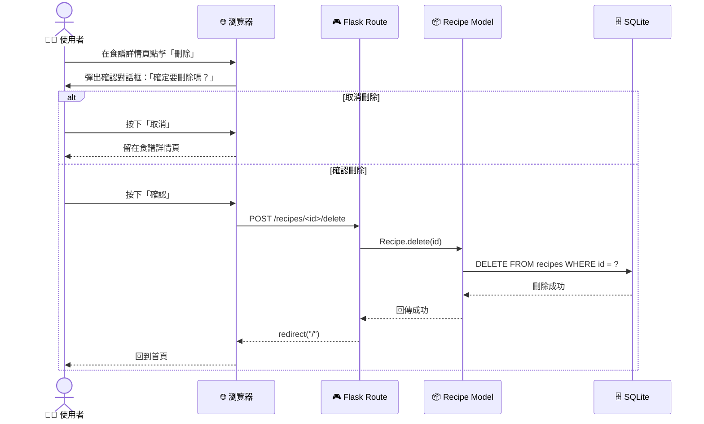
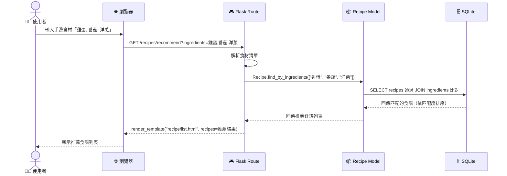

# 流程圖設計 — 食譜搜尋系統

## 1. 使用者流程圖（User Flow）

以下流程圖描述使用者從進入網站開始，可以進行的所有主要操作路徑：

### 流程說明

1. **進入首頁**：使用者開啟網頁後看到搜尋框與分類瀏覽區
2. **搜尋食譜**：輸入關鍵字 → 查看搜尋結果 → 點擊進入詳情頁
3. **瀏覽分類**：選擇料理分類 → 查看該分類食譜 → 點擊進入詳情頁
4. **上傳食譜**：填寫表單 → 驗證 → 儲存到資料庫 → 跳轉到詳情頁
5. **食材推薦**：輸入手邊食材 → 系統比對推薦 → 查看結果
6. **我的收藏**：瀏覽已收藏食譜 → 點擊進入詳情頁
7. **食譜操作**：在詳情頁可進行收藏 / 編輯 / 刪除等操作

---

## 2. 系統序列圖（Sequence Diagram）

### 2.1 搜尋食譜流程

### 2.2 上傳食譜流程

### 2.3 收藏食譜流程

### 2.4 編輯食譜流程

### 2.5 刪除食譜流程

### 2.6 食材推薦食譜流程

---

## 3. 功能清單對照表

| 功能 | URL 路徑 | HTTP 方法 | 說明 |
|------|----------|-----------|------|
| 首頁 | `/` | GET | 顯示搜尋框、分類瀏覽、推薦食譜 |
| 搜尋食譜 | `/recipes/search` | GET | 依關鍵字搜尋食譜，回傳結果列表 |
| 食譜列表 | `/recipes` | GET | 顯示所有食譜列表 |
| 食譜詳情 | `/recipes/<id>` | GET | 顯示單一食譜的完整資訊 |
| 新增食譜（表單） | `/recipes/create` | GET | 顯示上傳食譜的空白表單 |
| 新增食譜（送出） | `/recipes/create` | POST | 接收表單資料，建立新食譜 |
| 編輯食譜（表單） | `/recipes/<id>/edit` | GET | 顯示預填資料的編輯表單 |
| 編輯食譜（送出） | `/recipes/<id>/edit` | POST | 接收更新資料，修改食譜 |
| 刪除食譜 | `/recipes/<id>/delete` | POST | 刪除指定食譜 |
| 分類瀏覽 | `/categories/<name>` | GET | 顯示指定分類下的食譜列表 |
| 食材推薦 | `/recipes/recommend` | GET | 根據輸入的食材推薦食譜 |
| 加入收藏 | `/favorites/add` | POST | 將食譜加入收藏清單 |
| 取消收藏 | `/favorites/remove` | POST | 將食譜從收藏清單移除 |
| 我的收藏 | `/favorites` | GET | 顯示所有已收藏的食譜 |
